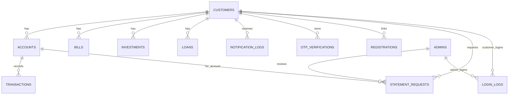

# Verified ERD Relationship Map

Generated from the current backend schema after FK cleanup and verification.

## Foreign Key Connectors

1. accounts.customerId -> customers.id
2. bills.customerId -> customers.id
3. investments.customerId -> customers.id
4. loans.customerId -> customers.id
5. notification_logs.userId -> customers.id
6. otp_verifications.customerId -> customers.id
7. registrations.customerId -> customers.id
8. transactions.accountId -> accounts.id
9. statement_requests.customerId -> customers.id
10. statement_requests.accountId -> accounts.id
11. statement_requests.reviewedByAdminId -> admins.id
12. login_logs.customerId -> customers.id
13. login_logs.adminId -> admins.id

## Cardinality For ERD

1. customers 1-to-many accounts
2. customers 1-to-many bills
3. customers 1-to-many investments
4. customers 1-to-many loans
5. customers 1-to-many notification_logs
6. customers 1-to-many otp_verifications
7. customers 1-to-many registrations
8. accounts 1-to-many transactions
9. customers 1-to-many statement_requests
10. accounts 1-to-many statement_requests
11. admins 1-to-many statement_requests
12. customers 1-to-many login_logs
13. admins 1-to-many login_logs

## Primary Keys

1. customers.id
2. accounts.id
3. bills.id
4. investments.id
5. loans.id
6. notification_logs.id
7. otp_verifications.id
8. registrations.id
9. transactions.id
10. statement_requests.id
11. login_logs.id
12. admins.id

## Optional Versus Required Foreign Keys

1. Required: accounts.customerId, bills.customerId, investments.customerId, loans.customerId, notification_logs.userId, otp_verifications.customerId, transactions.accountId, statement_requests.customerId, statement_requests.accountId
2. Optional nullable: registrations.customerId, statement_requests.reviewedByAdminId, login_logs.customerId, login_logs.adminId

## Mermaid ERD Snippet

## Verified Integrity

1. transactions.accountId orphan rows: 0
2. statement_requests.accountId orphan rows: 0
3. statement_requests.reviewedByAdminId orphan rows: 0
4. login_logs.customerId orphan rows: 0
5. login_logs.adminId orphan rows: 0
6. registrations.customerId orphan rows: 0
